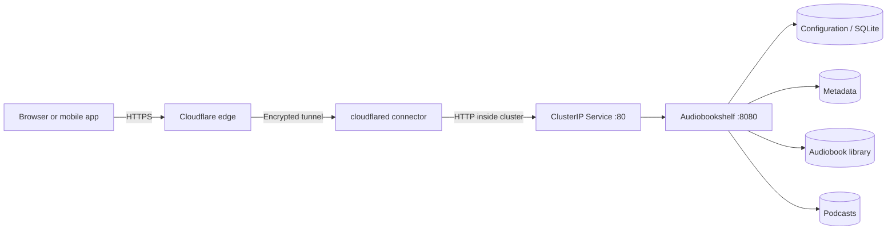

# Audiobook Service

**A self-hosted audiobook platform deployed on Kubernetes, with persistent storage and HTTPS access.**


This project documents how I deployed and operated Audiobookshelf in my homelab:
from durable local storage and container permissions to public routing and
troubleshooting media imports. Friends access the service through a browser
or a compatible mobile app using individual accounts.

Audiobookshelf is the upstream application. My work here is its Kubernetes
configuration, storage design, network integration, and operational runbook.

## Architecture



The connector establishes outbound connections, so public access does not
require router port forwarding. The application uses its own user accounts.
The connector and its credentials are provisioned separately; this repository
contains the application deployment and the route setup instructions.

## Engineering decisions

| Decision | Reason | Tradeoff |
|---|---|---|
| One replica with `Recreate` updates | Avoid simultaneous instances writing the SQLite database | Updates briefly interrupt service |
| Node-local persistent volumes | Keep SQLite on local storage and preserve media across pod replacement | The selected worker is a single point of failure |
| Retained volumes | Preserve data if a claim is accidentally deleted | Released volumes need manual recovery |
| Separate data mounts | Separate database, metadata, books and podcasts | More volumes to manage and back up |
| Non-root application container | Run with UID/GID 1000, dropped capabilities and no service-account token | Volume permissions must match |
| ClusterIP behind a tunnel | Keep the application origin internal | Public access depends on the tunnel provider |

## What is included

- [Kubernetes manifest](kubernetes/audiobookshelf.yaml): namespace, local-path
  storage class, four persistent claims, deployment and internal service.
- [Deployment guide](docs/deployment.md): prerequisites, storage placement,
  initial administrator setup and HTTPS routing.
- [Operations runbook](docs/operations.md): checks, imports, upgrades and recovery.
- [Validation and limitations](docs/validation.md): observed results and work
  that remains, distinguished from planned improvements.

## Quick start

Requires an existing Kubernetes cluster, `kubectl`, and Rancher's local-path
provisioner. These are application manifests, not a cluster installer.

```sh
# Select a worker with sufficient disk space. Replace YOUR_WORKER.
kubectl label node YOUR_WORKER audiobookshelf.storage=local
kubectl apply -f kubernetes/audiobookshelf.yaml
kubectl -n audiobookshelf rollout status deployment/audiobookshelf
kubectl -n audiobookshelf port-forward svc/audiobookshelf 13378:80
```

Open `http://localhost:13378`, create the administrator account, and add a
library pointing to `/audiobooks`. Complete initial setup before enabling the
public route. See the [deployment guide](docs/deployment.md) for details.

## Scope and status

The service was deployed and verified in a three-node homelab on October 5,
2026. This repository provides a portable reference configuration: select your
own storage worker and domain. It does not include account credentials, user
data, media files, or machine-specific volume identifiers.

This is a working homelab deployment, not a high-availability production
platform. It is manually deployed; no application GitOps reconciliation or
CI deployment pipeline is claimed. Off-node backups and a tested restore
procedure remain future work.

## Next improvements

- Automate off-node backups and test recovery.
- Alert on local disk usage and service availability.
- Add a dedicated GitOps application with scoped permissions.
- Evaluate storage redundancy and document the migration procedure.

## Upstream projects

[Audiobookshelf](https://github.com/advplyr/audiobookshelf) ·
[Local Path Provisioner](https://github.com/rancher/local-path-provisioner) ·
[Cloudflare Tunnel](https://developers.cloudflare.com/tunnel/)
